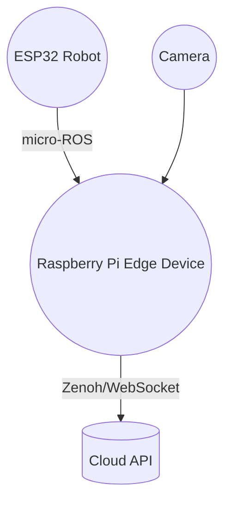

# OpenTier Robot Demonstrator

Welcome to the OpenTier Robot Demonstrator repository. This project showcases a
OpenTier Robot system that combines a micro-ROS powered mobile robot with a
Raspberry Pi edge device running ROS&nbsp;2. The goal is to demonstrate how an
affordable robot can perform computer vision locally while remaining connected
to cloud services.

## Purpose

This repository contains all the code required to build a small robot platform
and an edge device that communicate using ROS&nbsp;2. The mobile robot uses an
ESP32&nbsp;S3 board and micro-ROS to expose motor control and sensor data. The
edge device processes camera images, sends commands to the robot and relays
information to cloud services. Together, they form a complete demo of an open
robotics pipeline from embedded hardware to the cloud.

## Technologies

- **micro-ROS** and **ESP-IDF** for the robot firmware
- **ROS&nbsp;2 Jazzy** for the edge device nodes
- **Docker** to build reproducible environments
- **Python** and **C++** for the ROS&nbsp;2 packages
- **Zenoh** for cloud connectivity

## Architecture



### Networking stack

The ESP32 firmware communicates with the edge device over **micro-ROS** using
the **XRCE-DDS** transport. ROS&nbsp;2 nodes on the Raspberry&nbsp;Pi run with the
default **Fast DDS** middleware. A local **Zenoh** router (launched via
`zenohd`) connects the edge device to the cloud services.

## Project Structure

- **robot/**: Contains the ESP32 code for the mobile robot.
- **edge_device/**: Contains the Raspberry Pi code using ROS 2 for computer vision algorithms, cloud connectivity, and robot interaction.

## Getting Started

### Prerequisites

- ESP32 development environment
- Raspberry Pi with ROS 2 installed

### Installation

1. Clone this repository:
    ```sh
    git clone https://github.com/OpenTier/robot-demo.git
    cd robot-demo
    git submodule update --init --recursive
    ```

2. Follow the setup instructions in the respective directories:
    - robot/
    - edge_device/


### Run locally Edge Device software

Build image:

```sh
docker build -f docker/Dockerfile.edge_device -t edge_device_ros2:0.0.1 .
```

Run container:

```sh
docker run --name edge_device_ros2 edge_device_ros2:0.0.1
```


## Run on RPI and ESP32

1. Change zenoh config at `edge_device/ros2_ws/edge_device_launch/config/zenoh_config.json5` to use server IP
2. Setup, build and deploy the ROS 2 workspace on the Raspberry Pi

```sh
./scripts/install_ros2_on_rpi.sh
./scripts/copy_project_to_rpi.sh
./scripts/compile_on_rpi.sh
# Use transfer RPI to install ROS2 project on the RPI
# ./scripts/transfer_rpi_bundle.sh
```

3. Get RPI IP

```sh
./scripts/get_rpi_ip.sh
```

4. Change the `sdkconfig` Agent IP in `robot/open-t1/sdkconfig`
5. Set proper compilers flags
6. Build and flash the ESP32

